# Hedgehog P2P Object Store Guide

## Purpose

This guide explains how Hedgehog works as a system.

It is written for a human reader who wants to understand the architecture before reading implementation contracts, schemas, or risk registers.

Hedgehog v1-alpha is a head-mediated, client-encrypted, peer-to-peer object store.

In plain terms:
- users encrypt files or objects on their own machine
- public head nodes coordinate requests
- participant storage agents contribute disk space
- a SQLite metadata store decides what is allowed and where replicas live
- storage agents only hold ciphertext
- repair restores missing replicas when agents fail
- observability and audit records make the system operable

## Mental Model

Hedgehog separates data bytes from authority.

Storage agents hold bytes, but they do not decide whether bytes are live, readable, deleted, repaired, or trusted. The metadata store decides that.

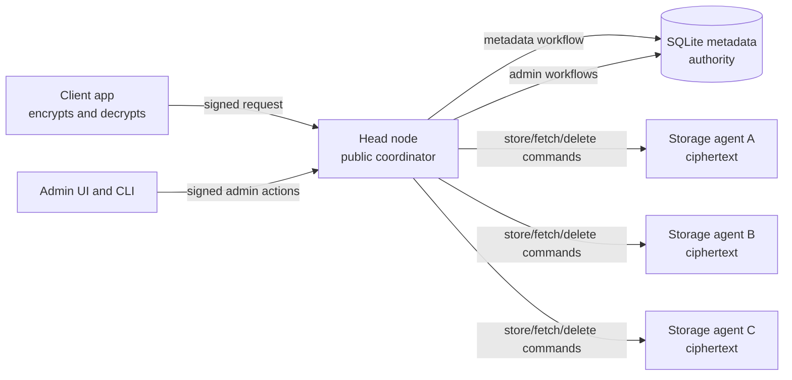

The first implementation uses SQLite so development stays simple. The metadata workflow crate is still named generically, `hedgehog-metadata-sql`, so PostgreSQL can be added later without changing the authority model.

## What The System Stores

Hedgehog stores immutable encrypted object versions.

An object is identified by:
- tenant
- dataset
- opaque object id
- lookup hash
- version

The payload is encrypted before upload. Servers see:
- opaque object identifier
- optional object lookup hash
- ciphertext length
- content hash
- encrypted payload bytes
- placement and replica metadata
- operational timing and health metadata

Servers do not see plaintext object contents.
Servers also do not need plaintext object names, paths, or filenames. Clients can store human-readable names in encrypted metadata.

An opaque object id is a random identifier, like a UUID. It is useful for durable internal references, but humans do not want to remember it.

For human lookup, the client computes:

```text
object_lookup_hash = HMAC-SHA256(dataset_lookup_secret, normalized_object_name)
```

So if Alice looks up `family/photo.jpg`, her client computes the same lookup hash every time. The metadata store can find the object by hash, but does not store `family/photo.jpg` as plaintext.

The lookup secret is scoped to a dataset. The full key model is defined in [p2p-object-store-key-model.md](p2p-object-store-key-model.md).

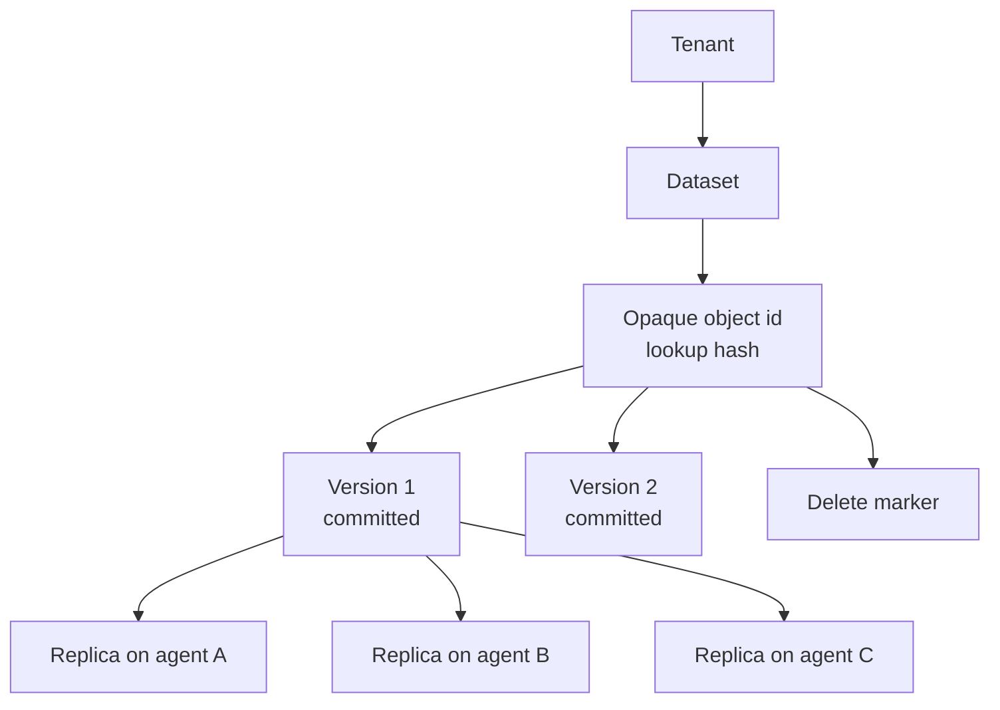

## Major Components

### Client

The client is the only component that handles plaintext payloads.

It:
- owns or unlocks user keys
- encrypts object bytes
- computes content hashes
- signs requests
- uploads ciphertext through a head node
- fetches ciphertext through a head node
- decrypts locally

### Head Node

A head node is public infrastructure. It is a coordinator, not a trust root.

It:
- accepts client and admin requests
- verifies signed envelopes
- rate-limits obvious abuse
- calls metadata workflows
- coordinates streams to and from storage agents
- exposes health, metrics, admin, and client APIs

It must not independently decide:
- placement
- object visibility
- revocation
- quota bypass
- repair ownership
- delete authority
- durable audit outcomes

### Metadata Store

The metadata store is the authority.

In v1-alpha it is SQLite, accessed through `hedgehog-metadata-sql`.

It owns:
- tenants and datasets
- object and version rows
- replica rows
- write reservations
- capacity accounting
- leases and fencing tokens
- repair jobs
- invitations
- identities and revocation epochs
- audit rows
- outbox rows

The metadata store does not own:
- plaintext payloads
- raw user encryption keys
- storage-agent local manifests
- Grafana time-series data

### Storage Agent

A storage agent runs on a participant machine.

It:
- reserves a configured amount of disk
- keeps an outbound connection to a head node
- receives store, fetch, verify, repair, and delete commands
- writes ciphertext to local disk
- records command journal entries
- records object manifests
- rejects stale fencing tokens
- reports capacity and anomalies

It cannot make an object visible by itself.

### Repair Worker

The repair worker restores durability when replicas are missing, corrupt, stale, or under-replicated.

In v1 repair is head-mediated:

```text
source agent -> head -> target agent
```

Direct agent-to-agent repair is deferred until the identity, authorization, revocation, transfer, and observability model is proven.

### Admin UI, CLI, Metrics, and Grafana

Admin surfaces let operators understand and control the system.

They show:
- metadata health
- agent health
- capacity pressure
- repair backlog
- replica deficits
- revocation state
- outbox lag
- audit events
- failed workflows

Admin actions still go through signed envelopes and metadata workflows.

## Authority Boundary

The most important rule is:

> Metadata decides meaning. Storage agents provide evidence.

For example, a storage agent can say, "I have bytes for version X and the hash matches." It cannot say, "version X is now committed and readable."

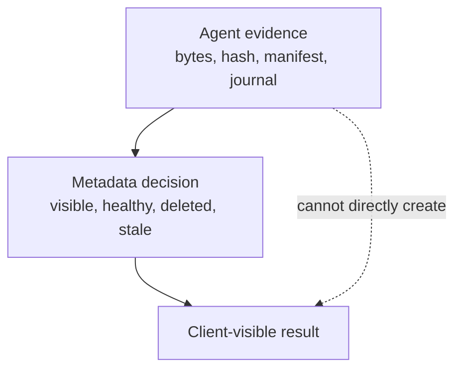

## Write Flow

A write stores a new immutable object version.

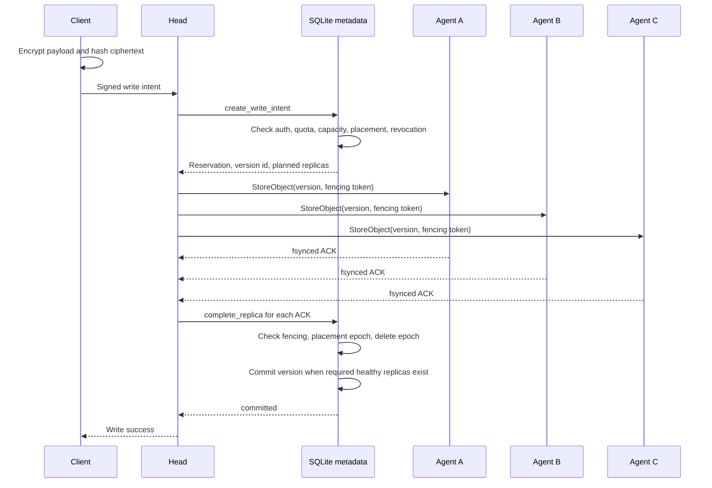

The client gets success only after metadata has committed the version.

If one agent fails during upload, metadata may still commit if the required replica count is satisfied. If not, the write remains uncommitted, expires, or becomes cleanup work.

## Read Flow

A read is authorized by metadata and served from an eligible replica.

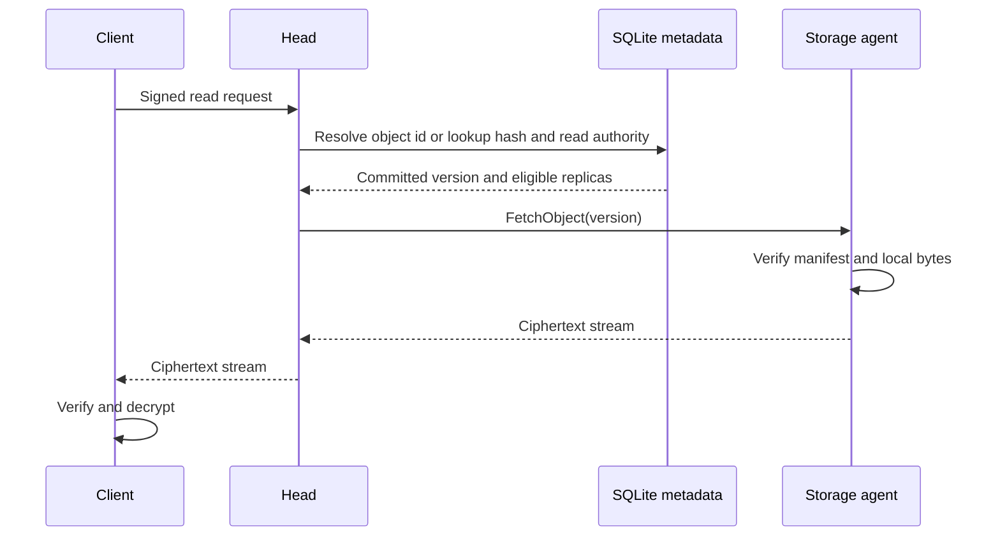

Reads can fetch from any healthy eligible replica. If the latest pointer or revocation data is stale, the head fails closed instead of guessing.

## Delete Flow

Deletes are logical first and physical later.

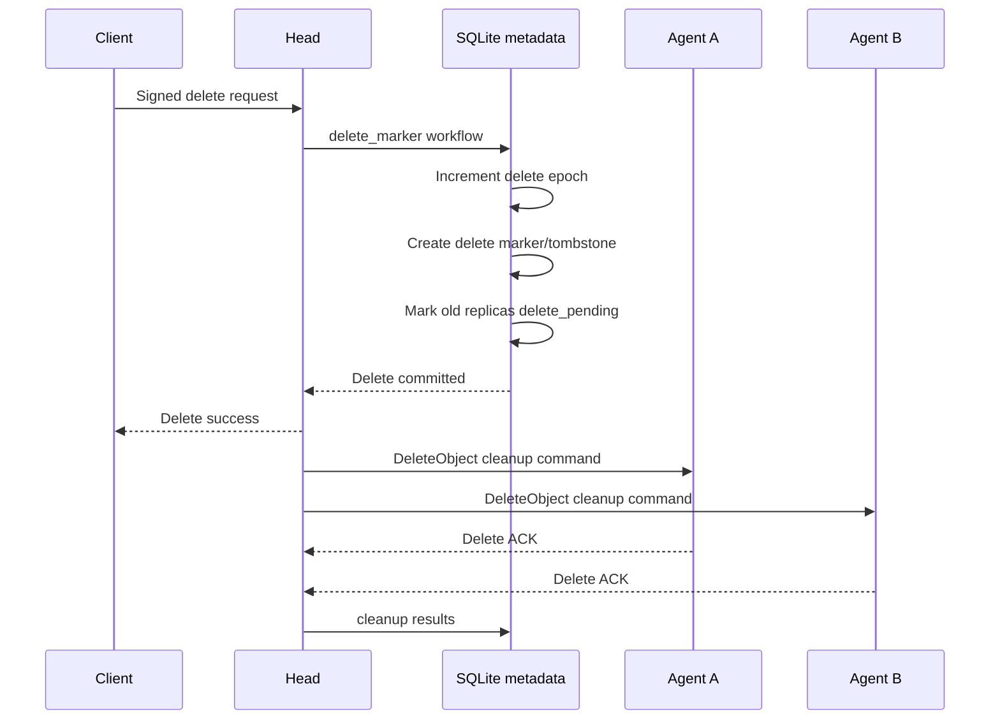

The delete marker prevents stale uploads or stale repair jobs from resurrecting old data.

Physical cleanup can be retried for as long as needed.

## Repair Flow

Repair restores the desired replica count.

Example: agent C is lost, and object version V needs a replacement replica on agent D.

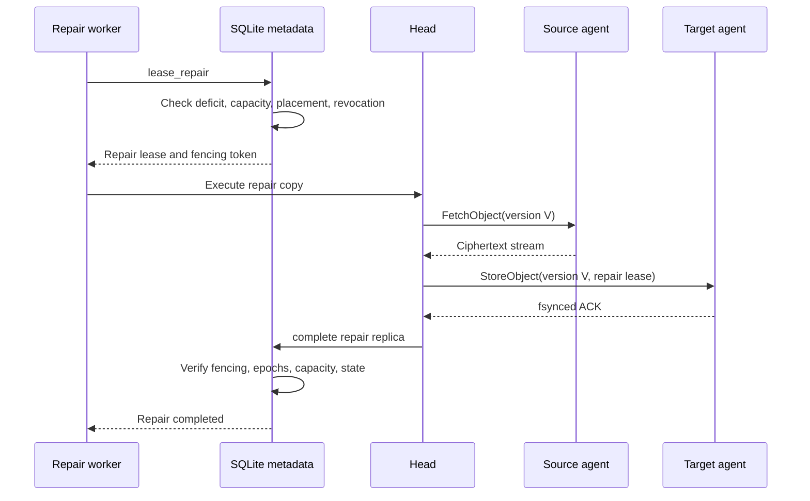

Direct agent-to-agent repair is deferred because it adds peer discovery, NAT traversal, authorization, abuse control, and observability complexity.

## State Labels

Canonical state labels are lowercase. These labels are used in Rust enums, SQL values, fixtures, metrics, admin filters, and dashboards.

Object version states:
- `writing`
- `committed`
- `under_replicated`
- `quarantined`
- `delete_marker`
- `gc_eligible`
- `garbage_collected`

Replica states:
- `planned`
- `streaming`
- `verifying`
- `healthy`
- `suspect`
- `corrupt`
- `stale`
- `delete_pending`
- `deleted`

Repair job states:
- `pending`
- `leased`
- `running`
- `verifying`
- `completed`
- `retry_wait`
- `failed_final`
- `canceled_superseded`

Reservation states:
- `pending`
- `reserved`
- `streaming`
- `finalizing`
- `committed`
- `expired`
- `aborted`
- `failed_cleanup_required`

## Version Lifecycle

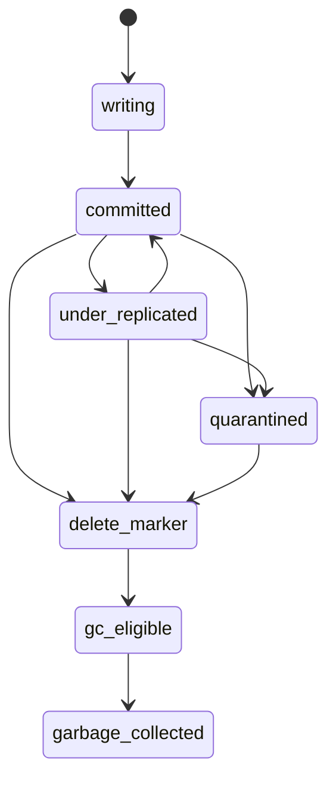

## Replica Lifecycle

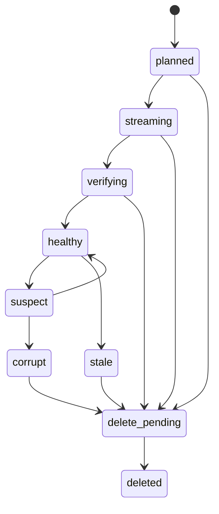

## Fencing, Placement Epochs, Delete Epochs

Hedgehog uses three separate safety concepts.

`fencing_token`:
- prevents old workers from completing stale work
- issued with leases
- checked on every mutation callback

`placement_epoch`:
- changes when placement for a version changes
- prevents old placement decisions from satisfying new policy

`delete_epoch`:
- changes when an object is deleted
- prevents late writes or repairs from resurrecting deleted data

Every final ACK must match:
- reservation id
- version id
- node id
- fencing token
- placement epoch
- delete epoch

If any value is stale, metadata rejects the ACK.

## Capacity Model

Capacity is not just free disk space.

The metadata store tracks logical reservations. Agents enforce local physical limits.

A write must pass:
- tenant quota
- dataset quota if configured
- eligible node count
- placement diversity
- per-node effective free capacity
- repair reserve
- temp-file reserve
- tombstone/orphan cleanup reserve
- fresh capacity report
- local agent admission

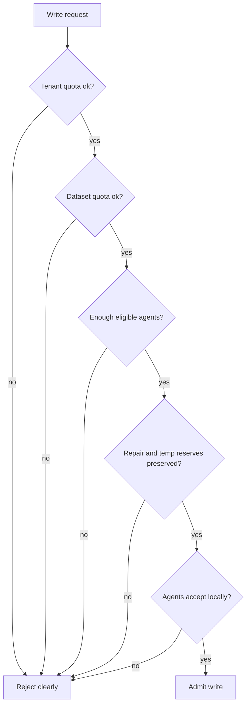

## Degraded Mode

When the metadata store is unavailable or recovering, heads fail closed.

Allowed during degraded read-only mode:
- health endpoints
- status pages that clearly show stale source time
- storage-agent keepalive
- telemetry buffering
- specific-version reads only if all required cached authority records are fresh

Rejected during metadata outage:
- writes
- deletes
- latest-pointer changes
- replica completions
- repair lease changes
- invitation actions
- admin mutations
- capacity admission
- durable audit/outbox mutations

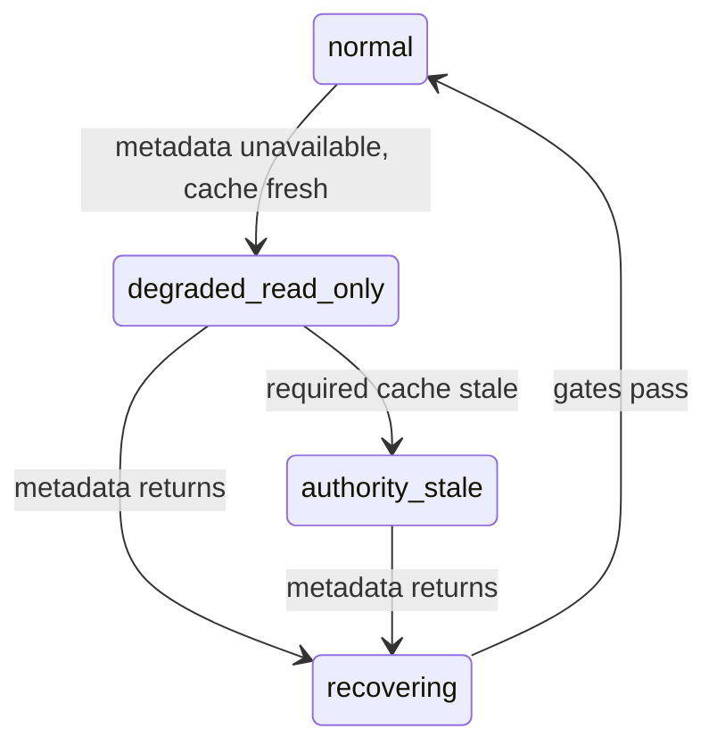

Recovery gates include:
- migrations current
- invariant checks pass
- audit append works
- outbox lag acceptable
- caches rebuilt
- agent manifests reconciled
- capacity reports fresh
- repair deficits known and queued

## Security Model

Security is based on signed authority and client-side encryption.

Required controls:
- signed client envelopes
- signed admin envelopes
- signed storage-agent messages
- invitation-based agent joining
- revocation epochs
- role-scoped admin actions
- audit rows for authority-changing operations
- metadata privacy rules

Heads can reject obvious bad requests, but final authority decisions happen through metadata workflows.

## Local V1-Alpha Runtime

The first runnable cluster should include:
- SQLite metadata database
- migrator
- one head node
- three storage agents
- one repair worker
- admin API/UI
- Prometheus
- Grafana
- optional OpenTelemetry collector

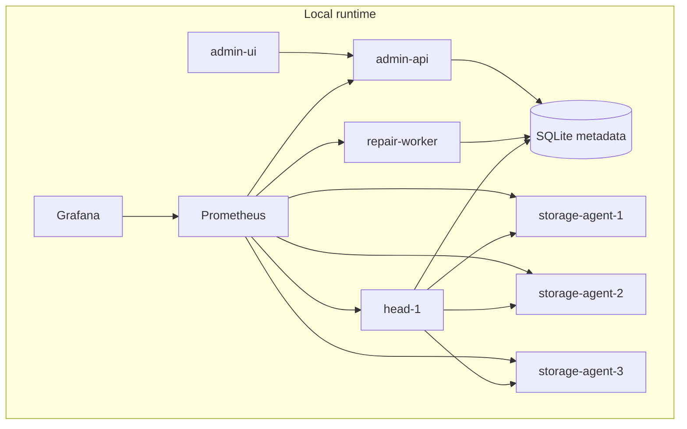

## What Is Deferred

Not v1-alpha:
- direct agent-to-agent repair
- local-first offline writes
- JSON secondary indexes
- CRDT field merges
- DynamoDB-compatible API behavior
- erasure coding
- chunk-level repair
- browser/mobile storage agents
- multi-cluster federation
- Rust-native Raft metadata

These are tracked in [p2p-object-store-deferred-design.md](p2p-object-store-deferred-design.md).

## End-To-End Example

Suppose Alice stores `photo.jpg` in dataset `family`.

1. Alice's client encrypts `photo.jpg`.
2. The client sends a signed write request to a head.
3. Metadata checks Alice's tenant, dataset, quota, capacity, and placement.
4. Metadata creates version `v1` in `writing` state and three planned replicas.
5. The head streams ciphertext to agents A, B, and C.
6. Each agent writes, verifies, fsyncs, journals, and ACKs.
7. Metadata accepts the ACKs and marks replicas `healthy`.
8. Metadata marks version `v1` as `committed`.
9. Alice can now read the object.
10. If agent C disappears later, metadata marks its replica `suspect` or `stale`.
11. Repair copies ciphertext through the head from A or B to D.
12. Metadata marks the new D replica `healthy`.
13. The system returns to the desired replica count.

In this example, `photo.jpg` is not required to appear in metadata as plaintext. Alice's client generates an opaque `object_id`, sends an `object_lookup_hash = HMAC(dataset_lookup_secret, "photo.jpg")`, and stores the display name in encrypted metadata.

## The Core Promise

Hedgehog v1-alpha promises a simple, inspectable object-storage foundation:
- encrypted payloads
- transactional metadata authority
- deterministic state labels
- durable local agent evidence
- head-mediated transfer
- repair after failure
- fail-closed degraded behavior
- operator-visible audit and metrics

It intentionally does not promise a full database yet. The object-store foundation comes first.
