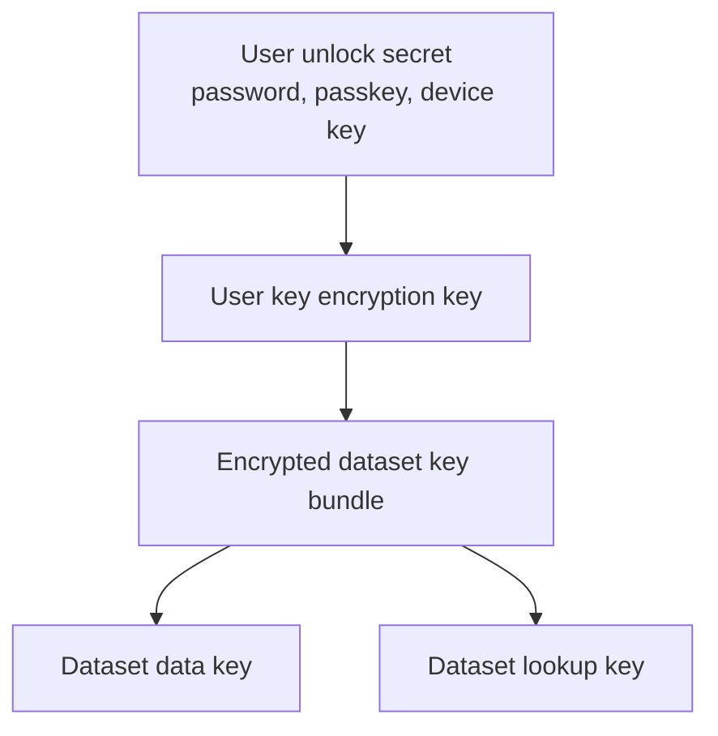

# Hedgehog V1-Alpha Key Model

## Purpose

This document defines the first key model for client-side encryption and human-name lookup.

The goal is simple:
- servers never need plaintext object bytes
- servers never need plaintext filenames or paths
- authorized clients can still look up objects by human-friendly names
- dataset sharing has a clear key boundary

## Key Hierarchy

V1-alpha uses dataset-scoped keys.



Each dataset has:
- `dataset_data_key`: used to wrap or derive object encryption keys
- `dataset_lookup_key`: used to compute lookup hashes for human-readable names

The metadata store does not store either key in plaintext.

## Object Payload Encryption

Recommended v1-alpha model:

```text
object_data_key = random 256-bit key per object version
ciphertext = AEAD_Encrypt(object_data_key, plaintext)
wrapped_object_data_key = Wrap(dataset_data_key, object_data_key)
```

Metadata may store:
- encryption algorithm
- key id
- wrapped object data key or encrypted metadata reference
- ciphertext hash
- ciphertext size

Metadata must not store:
- plaintext object bytes
- raw object data key
- raw dataset data key

## Human Name Lookup

Users should be able to ask for names like:

```text
family/photo.jpg
taxes/2025/return.pdf
```

The metadata store should not store those names as plaintext.

The client computes:

```text
object_lookup_hash = HMAC-SHA256(dataset_lookup_key, normalized_object_name)
```

The metadata store stores:

```text
tenant_id
dataset_id
object_id
object_lookup_hash
```

When the client wants to fetch `family/photo.jpg`, it normalizes the name, computes the same HMAC, and asks metadata for that lookup hash.

## Name Normalization

V1-alpha needs one deterministic normalization rule before clients exist.

Recommended seed rule:
- UTF-8 input
- Unicode NFC normalization
- slash `/` as path separator
- reject empty path components
- reject `.` and `..` components
- preserve case
- no trailing slash for objects

This means these are different names:

```text
Photo.jpg
photo.jpg
```

Case folding can be added later as a product choice, but it should not be accidental.

## Object ID

`object_id` is an internal random identifier.

Use:

```text
UUID v7 or 128-bit random id
```

Humans do not need to know it. It gives metadata, audit, repair, and object-version rows a stable internal handle that does not reveal the object name.

## Sharing

Dataset sharing means sharing access to:
- dataset metadata authorization
- dataset data key material
- dataset lookup key material

A user who has the dataset lookup key can test guesses for names inside that dataset. That is acceptable because dataset members are authorized to find names in that dataset.

Different datasets use different lookup keys, so identical names in different datasets do not produce the same lookup hash.

## Revocation And Rotation

V1-alpha revocation is metadata-enforced first.

When a user is revoked:
- metadata denies new reads/writes for that actor
- heads reject signed envelopes from revoked keys
- audit records the revocation

Cryptographic removal from already-shared dataset keys requires rotation.

Rotation path:
1. Create a new dataset key version.
2. Rewrap future object data keys with the new dataset data key.
3. Compute future lookup hashes with the new dataset lookup key.
4. Keep old key versions for authorized migration/reads until re-encryption finishes.
5. Do not let revoked actors use old key versions through metadata authority.

Full re-encryption can be deferred, but the key-version fields must exist early enough that rotation is not impossible later.

## Metadata Fields

Dataset metadata should include:
- `dataset_id`
- `tenant_id`
- `current_key_epoch`
- `current_lookup_key_id`
- `current_data_key_id`

Object metadata should include:
- `object_id`
- `dataset_id`
- `object_lookup_hash`
- `lookup_key_id`
- `encrypted_name_metadata`

Object-version metadata should include:
- `version_id`
- `object_id`
- `data_key_id`
- `encryption_alg`
- `wrapped_object_data_key` or `encryption_metadata_ref`
- `content_hash`
- `size_bytes`

## Security Notes

The lookup hash hides plaintext names from the server, but it does not hide:
- object count
- object size
- write timing
- read timing
- which object is accessed repeatedly
- which dataset owns the object
- which agents store replicas

Metadata is still sensitive and must be treated as confidential operational state.

## V1 Decision

Accepted:

```text
object_lookup_hash = HMAC-SHA256(dataset_lookup_key, normalized_object_name)
```

The lookup key is scoped per dataset, not globally per user.

Plaintext names, paths, and filenames are not required in metadata.
